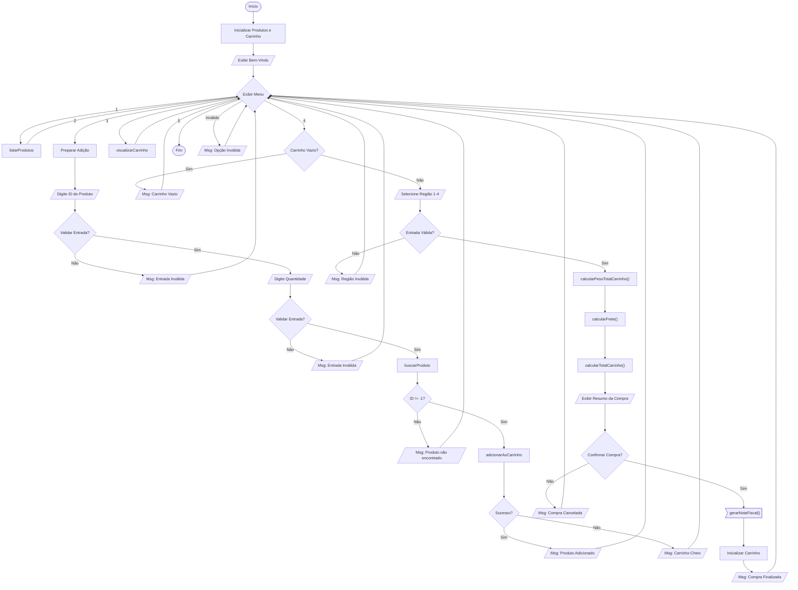

```mermaid
flowchart TD
    %% Shapes Definition:
    %% ([Start/End])
    %% [Process]
    %% [/Input/Output/]
    %% {Decision}
    %% >Document]

    Start([Início]) --> Init[Inicializar Produtos e Carrinho]
    Init --> Header[/Exibir Bem-Vindo/]
    Header --> Menu{Exibir Menu}

    %% Loop Principal
    Menu -->|1| Op1[listarProdutos]
    Op1 --> Menu

    Menu -->|2| Op2[Preparar Adição]
    Op2 --> AskID[/Digite ID do Produto/]
    AskID --> ValidID{Validar Entrada?}
    
    ValidID -- Não --> ErrID[/Msg: Entrada Inválida/]
    ErrID --> Menu
    
    ValidID -- Sim --> AskQtd[/Digite Quantidade/]
    AskQtd --> ValidQtd{Validar Entrada?}

    ValidQtd -- Não --> ErrQtd[/Msg: Entrada Inválida/]
    ErrQtd --> Menu

    ValidQtd -- Sim --> Search[buscarProduto]
    Search --> Found{ID != -1?}
    
    Found -- Não --> MsgNotFound[/Msg: Produto não encontrado/]
    MsgNotFound --> Menu

    Found -- Sim --> Add[adicionarAoCarrinho]
    Add --> CheckAdd{Sucesso?}
    CheckAdd -- Sim --> MsgAdd[/Msg: Produto Adicionado/]
    CheckAdd -- Não --> MsgFull[/Msg: Carrinho Cheio/]
    
    MsgAdd --> Menu
    MsgFull --> Menu

    Menu -->|3| Op3[visualizarCarrinho]
    Op3 --> Menu

    Menu -->|4| Op4{Carrinho Vazio?}
    Op4 -- Sim --> MsgEmpty[/Msg: Carrinho Vazio/]
    MsgEmpty --> Menu

    Op4 -- Não --> AskReg[/Selecione Região 1-4/]
    AskReg --> ValidReg{Entrada Válida?}
    
    ValidReg -- Não --> MsgInvReg[/Msg: Região Inválida/]
    MsgInvReg --> Menu

    ValidReg -- Sim --> CalcPeso["calcularPesoTotalCarrinho()"]
    CalcPeso --> CalcFrete["calcularFrete()"]
    CalcFrete --> CalcTotal["calcularTotalCarrinho()"]
    CalcTotal --> ShowRes[/Exibir Resumo da Compra/]
    
    ShowRes --> Confirm{Confirmar Compra?}
    Confirm -- Não --> MsgCancel[/Msg: Compra Cancelada/]
    MsgCancel --> Menu

    Confirm -- Sim --> GenNF>"gerarNotaFiscal()"]
    GenNF --> Clear[Inicializar Carrinho]
    Clear --> MsgEnd[/Msg: Compra Finalizada/]
    MsgEnd --> Menu

    Menu -->|5| End([Fim])

    Menu -->|Inválido| MsgInvOpt[/Msg: Opção Inválida/]
    MsgInvOpt --> Menu
```
